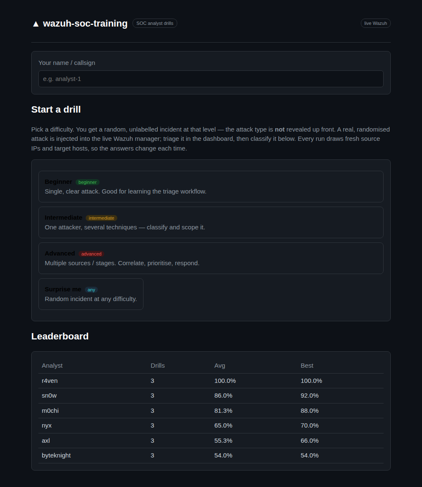
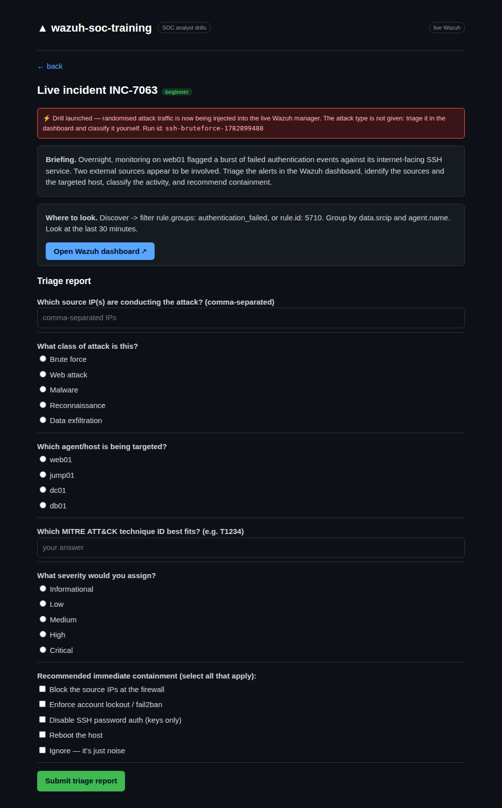
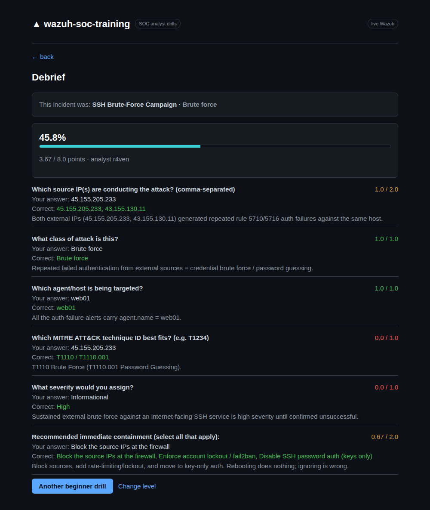

# wazuh-soc-training — Installation & User Manual

A self-contained SOC-analyst **training range** for [Wazuh](https://wazuh.com). It
injects synthetic, labeled attacks into a **live Wazuh manager** so analysts
practise triage in the **real Wazuh dashboard**, then auto-grades their answers
and keeps a leaderboard.

> ⚠️ **Training tool, not a security control.** It writes events into a live
> Wazuh manager. Run it on a **lab / training** Wazuh you do not rely on for real
> detection — never a production manager. Provided as-is, no warranty.

---

## Table of contents

1. [What you get](#1-what-you-get)
2. [How it works (architecture)](#2-how-it-works-architecture)
3. [System requirements](#3-system-requirements)
4. [Bare metal vs VM vs cloud](#4-bare-metal-vs-vm-vs-cloud)
5. [Operating system & prerequisites](#5-operating-system--prerequisites)
6. [Install — the fast path (one command)](#6-install--the-fast-path-one-command)
7. [Install — manual stages](#7-install--manual-stages)
8. [Configuration reference](#8-configuration-reference)
9. [User manual — running a drill as a trainee](#9-user-manual--running-a-drill-as-a-trainee)
10. [Scenario catalogue](#10-scenario-catalogue)
11. [Authoring your own scenarios](#11-authoring-your-own-scenarios)
12. [Administration & operations](#12-administration--operations)
13. [Troubleshooting](#13-troubleshooting)
14. [Security notes](#14-security-notes)
15. [Uninstall / reset](#15-uninstall--reset)

---

## 1. What you get

- A **web launcher** (port `8101`, pure-Python stdlib) where a trainee picks a
  **difficulty level** and receives a **blind, randomised incident**.
- **Live injection** into the Wazuh manager over the analysisd queue socket — the
  resulting alerts are indistinguishable from real ones and land in
  `wazuh-alerts-*`.
- A **DB-only agent fleet**: simulated endpoints registered in the manager and
  kept **Active** by a keepalive simulator — no VMs or containers per endpoint.
- **Auto-grading** against each run's ground truth, a per-question debrief, and a
  persistent **leaderboard** (SQLite).

Everything the trainee learns — Discover queries, `rule.groups`, `data.srcip`
pivots, agent correlation — transfers directly to a production Wazuh console.



*The launcher: pick a difficulty, get a blind incident. Leaderboard tracks every
analyst. (Wazuh triage happens in the standard Wazuh dashboard, not shown — it is
stock Wazuh.)*

---

## 2. How it works (architecture)

```
        wazuh-soc-training host  (== the Wazuh manager)
 ┌──────────────────────────────────────────────────────────────┐
 │                                                                │
 │  app.py (web UI :8101) ── pick level ──► randomizer.py         │
 │        │                                    │ materialise run  │
 │        │                                    ▼                  │
 │        │                              injector.py              │
 │        │                                    │ queue socket     │
 │        │                                    ▼                  │
 │        │              /var/ossec/queue/sockets/queue           │
 │        │                                    │                  │
 │        │                              wazuh-manager (analysisd)│
 │        │                                    │ rules fire       │
 │        │                                    ▼                  │
 │        │                              wazuh-indexer (9200)     │
 │        │                                    │                  │
 │        │                              wazuh-dashboard (443) ───┼──► trainee
 │        │                                                       │    triages here
 │        └── submit answers ──► scoring.py ──► SQLite leaderboard│
 │                                                                │
 │  agent_sim.py ── AES-256 keepalives :1514 ──► manager (fleet Active) │
 └──────────────────────────────────────────────────────────────┘
```

**Hard constraint:** the injector writes a **local UNIX datagram socket**
(`/var/ossec/queue/sockets/queue`, owned `wazuh:wazuh`). It **cannot inject
remotely** — the training tool must run **on the Wazuh manager itself**, as
`root` or the `wazuh` user.

**Verified rule coverage.** Scenarios only use event templates confirmed to fire
a rule *and* carry `data.srcip` on a stock ruleset:

| Template | Fires rule | Bucket |
|----------|-----------|--------|
| `sshd_invalid` / `sshd_failed` | 5710 / 5716 (`authentication_failed`) | brute force |
| `web_sqli` / `web_xss` / `web_traversal` / `web_cmdinj` | 31106 (`web,accesslog,attack`, HTTP 200) | web attack |

Malware / ransomware / C2 / recon require endpoint FIM, rootcheck, Sysmon, or
custom rules that a stock manager does not emit from raw syslog — those are
intentionally **not** included.

---

## 3. System requirements

The heavy component is **Wazuh all-in-one** (indexer + manager + dashboard on one
host). The training tool itself is featherweight (stdlib Python, a few MB RAM).
Size the box for Wazuh.

### Reference minimum — the `.40` build

This manual's reference box is deliberately modest; treat it as the **practical
floor** for a smooth single-trainee lab:

| Component | `.40` reference | Notes |
|-----------|-----------------|-------|
| CPU | Intel i7-7700HQ — **4 cores / 8 threads**, x86-64 | 2015-era mobile CPU. Fine for one lab. |
| RAM | **16 GB** | Wazuh indexer JVM defaults to ~4 GB heap; manager + dashboard + OS eat the rest. |
| Disk | **SSD**, ~230 GB (≈45 GB free is enough for a lab) | SSD strongly recommended — the indexer is I/O-bound. |
| Swap | 16 GB swapfile | A safety net on 16 GB RAM; the indexer dislikes OOM. |
| OS | **Ubuntu 24.04.4 LTS**, kernel 6.x | See §5 for supported distros. |
| Form factor | **Bare metal** | No nested virt; `systemd-detect-virt = none`. |

### Tiers

| Tier | vCPU | RAM | Disk | Suitable for |
|------|------|-----|------|--------------|
| **Absolute floor** | 2 | 4 GB | 30 GB SSD | Will *install and run*, but sluggish; indexer heap must be trimmed to ~1–2 GB. Single trainee, patience required. |
| **Practical minimum (= `.40`)** | 4 | 16 GB | 50 GB SSD | Comfortable single-trainee lab, default 4 GB indexer heap, room for a small fleet + weeks of alert retention. |
| **Recommended** | 8 | 16–32 GB | 100 GB+ SSD | Several concurrent trainees, longer retention, headroom for bursty injection. |

**Why 16 GB is the sweet spot:** Wazuh's own guidance for an all-in-one node is
2 vCPU / 4 GB *minimum* and 8 vCPU / 16 GB *recommended*. The indexer (OpenSearch
fork) is a JVM and will happily take 50 % of RAM as heap. On 4 GB you must clamp
the heap in `/etc/wazuh-indexer/jvm.options` (e.g. `-Xms1g -Xmx1g`) or it
thrashes. On 16 GB the defaults just work.

**Disk growth:** a lab generates little data, but the indexer pre-allocates and
retention accrues. Budget ~25 GB for the install and 1–5 GB/week of light drills.
Prune old indices if you run for months (see §12).

**Kernel setting (mandatory):** the indexer needs
`vm.max_map_count = 262144`. The installer/bootstrap sets it and persists it in
`/etc/sysctl.conf`. On `.40` it is already set.

---

## 4. Bare metal vs VM vs cloud

Any of the three works — the only firm rules are **one dedicated host**, **enough
RAM**, and **no nested-virtualisation surprises**.

| Option | Verdict | Notes |
|--------|---------|-------|
| **Bare metal** (the `.40` reference) | ✅ Ideal for a throwaway lab | An old laptop/NUC/desktop with 16 GB + an SSD is perfect. No hypervisor overhead. Reinstall/wipe freely. |
| **VM** (VMware, Proxmox, KVM/libvirt, Hyper-V, VirtualBox) | ✅ Recommended for most | Give it **≥4 vCPU, ≥8 GB (16 GB better), ≥50 GB SSD-backed disk**. Enable the disk as thin/SSD. Snapshot before install so you can roll back to a clean lab instantly. Avoid ballooning RAM below the indexer heap. |
| **Cloud VM** (AWS EC2, Azure, GCP, Hetzner, DigitalOcean) | ✅ Works | ~`t3.xlarge` / `Standard_D4s` / 4 vCPU-16 GB class. **Lock down the security group** — expose nothing publicly; reach it over VPN/SSH tunnel only (the dashboard on 443 and the tool on 8101 must not face the internet). |
| **Containers (Docker) for the *server*** | ⚠️ Not covered | The bootstrap installs Wazuh as native services (systemd). Dockerised Wazuh is possible but out of scope here. The *fleet* agents can optionally be containers (see the real-agent path in `docs/DEPLOY.md`); the default fleet is DB-only and needs no containers at all. |
| **WSL2** | ❌ Avoid | systemd + the indexer + `vm.max_map_count` under WSL is fragile. Use a real VM. |

**Snapshot tip (VM):** take a snapshot right after a clean bootstrap. "Fresh
start as a trainee" then becomes *revert snapshot* instead of *uninstall +
reinstall*.

---

## 5. Operating system & prerequisites

### Supported OS

Wazuh 4.x AIO supports current 64-bit Linux. Verified here on **Ubuntu 24.04
LTS**. Also fine: Ubuntu 22.04, Debian 11/12, RHEL/Alma/Rocky 8/9, Amazon Linux
2. Use a **64-bit x86-64** build (ARM64 is possible for Wazuh but the fleet
container image and this manual assume x86-64).

### Prerequisites

- `root` / `sudo` on the host.
- **Python 3.8+** (the tool is stdlib-only; 3.10+ is what ships on Ubuntu 24.04).
- `curl`, `openssl` (used by the installer and fleet enrollment).
- Outbound HTTPS to `packages.wazuh.com` for the Wazuh install (one time).
- Free ports on the host: **443** (dashboard), **1514/1515** (agent
  comms/enrollment), **9200/9300** (indexer), **55000** (manager API),
  **8101** (training tool).

### Firewall

For a single-box lab reached over the LAN/VPN, open (or leave open on the
loopback/internal interface): `443`, `1514`, `1515`, `8101`. Keep `9200`,
`9300`, `55000` **local** unless you know you need them remotely. Never expose
`8101` (no auth by default) or `443` to the public internet.

---

## 6. Install — the fast path (one command)

The only real thing you provide is **one Linux box** meeting §3. Endpoints/agents
are DB-only.

```bash
git clone https://github.com/diagonalciso/wazuh-soc-training
cd wazuh-soc-training
sudo ./bootstrap.sh
```

`bootstrap.sh` does, in order:

1. **Installs Wazuh AIO** (indexer + manager + dashboard) if `/var/ossec` is
   absent — sets `vm.max_map_count`, downloads `wazuh-install.sh`, runs
   `-a -i`. *This step is slow (5–20 min depending on the box).*
2. **Installs the tool** to `/opt/wazuh-soc-training`.
3. **Enrolls the DB-only fleet** from `lab/fleet.txt` (falls back to
   `fleet.example.txt`) via authd and starts `wazuh-agent-sim.service` so they
   flip **Active** within ~1 min.
4. **Writes** `/etc/wazuh-soc-training.env` and starts
   `wazuh-soc-training.service`.

When done it prints:

```
  Wazuh dashboard : https://<host>        (user admin)
  Training tool   : http://<host>:8101/
  Fleet agents    : 001:web01,002:web02,...
```

The Wazuh **admin password** is printed once and stored in
`/root/wazuh-install-files.tar` (`wazuh-passwords.txt` inside).

### Flags

```bash
sudo ./bootstrap.sh --no-wazuh      # Wazuh already present; skip its install
sudo SKIP_FLEET=1 ./bootstrap.sh    # server + tool only, no simulated agents
sudo WAZUH_VERSION=4.14 ./bootstrap.sh   # pin a Wazuh minor
```

### Throwaway VM (Vagrant)

Prefer a disposable VM? The included `Vagrantfile` boots an Ubuntu 22.04 guest
and runs the same `bootstrap.sh` inside it — the whole lab (Wazuh AIO + tool +
DB-only agents) in one command, nothing installed on your host.

**Prerequisites:** [Vagrant](https://developer.hashicorp.com/vagrant/downloads)
plus a provider — VirtualBox (cross-platform) or libvirt/KVM (Linux). The VM
needs **≥4 GB RAM** (the indexer is hungry); default is 6 GB / 2 vCPU.

```bash
# from the repo root
vagrant up                      # boots VM, provisions Wazuh + lab + tool (~10-15 min)
vagrant ssh                     # shell into the guest if needed
```

Then, from your host browser:

```
https://192.168.56.20           # Wazuh dashboard  (user: admin)
http://192.168.56.20:8101       # training tool
```

The admin password is printed by the provisioner and saved inside the VM at
`/root/wazuh-install-files.tar` — `vagrant ssh` then `sudo tar xf
/root/wazuh-install-files.tar -O wazuh-passwords.txt` (or `sudo cat` the
extracted file) to read it.

Tune size or pick a provider explicitly:

```bash
LAB_MEM_MB=8192 LAB_CPUS=4 vagrant up            # bigger VM
vagrant up --provider=virtualbox                 # force VirtualBox
vagrant up --provider=libvirt                    # force KVM/libvirt
```

Reset or dispose:

```bash
vagrant provision      # re-run bootstrap.sh in place
vagrant reload         # reboot the VM
vagrant destroy -f     # delete the VM entirely — clean slate
```

The private-network IP (`192.168.56.20`), box, and default size live at the top
of the `Vagrantfile`; edit there if `192.168.56.0/24` clashes on your host.

---

## 7. Install — manual stages

Use this if you want control, are adding the tool to an **existing** manager, or
are following the full runbook in [`docs/DEPLOY.md`](DEPLOY.md).

### Stage 0 — size & prepare the host

Meet §3. Confirm the kernel setting:

```bash
sudo sysctl -w vm.max_map_count=262144
grep -q vm.max_map_count /etc/sysctl.conf || echo 'vm.max_map_count=262144' | sudo tee -a /etc/sysctl.conf
```

### Stage 1 — install Wazuh all-in-one

```bash
cd /root
curl -sO https://packages.wazuh.com/4.14/wazuh-install.sh
sudo bash wazuh-install.sh -a -i
```

Wait for **all three** services to be green:

```bash
systemctl is-active wazuh-indexer wazuh-manager wazuh-dashboard filebeat
curl -sk https://127.0.0.1:443/  -o /dev/null -w '%{http_code}\n'   # 200/302 when up
```

On a slow box the manager and security-index init can take several minutes.
Retrieve the admin password from `/root/wazuh-install-files.tar`.

### Stage 2 — enroll the DB-only fleet (optional but recommended)

```bash
cd /opt/wazuh-soc-training/lab      # or the cloned repo's lab/
cp fleet.example.txt fleet.txt      # edit hosts/roles if you like
cat > lab.env <<'EOF'
MANAGER_IP=127.0.0.1
AUTH_PORT=1515
FLEET_FILE=fleet.txt
KEYS_OUT=/opt/wazuh-soc-training/lab/agent_sim.keys
EOF
sudo bash enroll-fleet.sh           # prints TRAIN_AGENTS=001:web01:linux,003:dc01:windows-server,...
```

> **Enrollment uses IP `any` on purpose.** The simulator connects from
> `127.0.0.1`; registering agents with a fixed IP makes remoted reject every
> keepalive with `(1408): Invalid ID ... for the source ip: '127.0.0.1'` and the
> agents stay *Never connected*. `enroll-fleet.sh` forces `IP:'any'`; the IP
> column in `fleet.txt` is kept only for readable topology.

Start the keepalive simulator so the fleet shows **Active**:

```bash
sudo install -m644 wazuh-agent-sim.service /etc/systemd/system/
sudo systemctl daemon-reload
sudo systemctl enable --now wazuh-agent-sim.service
sudo /var/ossec/bin/agent_control -l   # verify agents = Active
```

### Stage 3 — install & start the training tool

```bash
sudo mkdir -p /opt/wazuh-soc-training
sudo cp -r . /opt/wazuh-soc-training/         # from the repo root
sudo cp wazuh-soc-training.env.example /etc/wazuh-soc-training.env
sudo chmod 600 /etc/wazuh-soc-training.env
sudoedit /etc/wazuh-soc-training.env          # set the values in §8
sudo install -m644 wazuh-soc-training.service /etc/systemd/system/
sudo systemctl daemon-reload
sudo systemctl enable --now wazuh-soc-training.service
curl -s http://127.0.0.1:8101/healthz          # {"ok":true}
```

**Only two fields must be edited** in `/etc/wazuh-soc-training.env`:

| Field | Set to |
|-------|--------|
| `WAZUH_DASHBOARD_URL` | The real Wazuh dashboard URL the trainee triages in, e.g. `https://10.10.0.10`. |
| `TRAIN_AGENTS` | Real `id:name` pairs on **this** manager (comma-separated). Drives which hosts scenarios target and the names shown to the trainee. Get them with `sudo /var/ossec/bin/agent_control -l`. |

Everything else has a working default. `QUEUE_SOCKET` is the standard local
analysisd path; the `INDEXER_*` block is only used if you extend the tool to
verify landed events (unused otherwise — leave `INDEXER_PASS` as-is);
`TRAIN_BIND` can be narrowed from `0.0.0.0` to an internal IP to limit exposure.

### Stage 4 — run a drill

Open `http://<host>:8101/`. See §9.

---

## 8. Configuration reference

All config is environment-driven (`config.py`). Live file:
`/etc/wazuh-soc-training.env` (chmod `600`, service runs as root).

| Variable | Default | Purpose |
|----------|---------|---------|
| `QUEUE_SOCKET` | `/var/ossec/queue/sockets/queue` | analysisd injection socket (local). |
| `WAZUH_DASHBOARD_URL` | `https://127.0.0.1` | Dashboard link shown to the trainee. Set to the host's reachable URL. |
| `TRAIN_PORT` | `8101` | Web UI port. |
| `TRAIN_BIND` | `0.0.0.0` | Bind address. Use an internal IP to restrict exposure. |
| `TRAIN_DB` | `<install>/training.db` | SQLite leaderboard/attempts DB. |
| `TRAIN_AGENTS` | `001:web01,002:db01,003:dc01,...` | **Real** agent IDs↔names on this manager. Scenarios target these; names are shown to the trainee. Produced by `enroll-fleet.sh`. |
| `SCENARIO_DIR` | `<install>/scenarios` | Scenario JSON directory. |
| `INDEXER_URL` | `https://127.0.0.1:9200` | Read-only, only used if you extend the tool to verify landed events. |
| `INDEXER_USER` / `INDEXER_PASS` | `monitor` / — | Read-only indexer account (create in Wazuh if you use verification). |
| `INDEXER_CA` | — | Set a CA path to verify TLS; empty = verification off (localhost only). |

**`TRAIN_AGENTS` must reference agents that actually exist** on the manager (real
or DB-only simulated). Injected alerts are attributed to these IDs; unknown IDs
produce alerts with no agent context.

---

## 9. User manual — running a drill as a trainee

The workflow is **blind**: you choose a difficulty, not an attack. You must
classify the incident yourself from the evidence — exactly like a real shift.

### Step 1 — open the launcher

Browse to `http://<host>:8101/`. You see the leaderboard and three difficulty
buttons.

### Step 2 — pick a difficulty (not an attack)

| Level | Expect |
|-------|--------|
| **Beginner** | Single, obvious attack pattern. Identify source IP(s) + target host, basic containment. |
| **Intermediate** | Requires reading the payload / distinguishing similar techniques (spray vs brute force, payload class). |
| **Advanced** | Multiple actors / kill-chain stages. Separate the noise, prioritise, recommend IR action. |

"**Surprise me**" picks a random level. Each start serves a **random,
unlabelled** incident at that level — the attack type is hidden until debrief,
and the source IPs / target host / event volumes are **re-randomised every run**,
so answers can't be memorised.

### Step 3 — start the drill (this injects)

Clicking start injects the labeled attack into the live manager. You get:

- An **incident code** (e.g. `INC-4821`) — neutral, no spoilers.
- A **briefing** with observable facts only (what a SOC would see on the wire).
- A **"Open Wazuh dashboard"** link.
- The **triage questions** you must answer.

Injection is paced to look realistic — give it up to ~30–60 s for alerts to ship
through filebeat into the dashboard.



*A blind incident (`INC-7063`): observable briefing only, a "where to look" hint,
the dashboard link, and the triage questions. No attack label.*

### Step 4 — triage in the real Wazuh dashboard

Log into the dashboard (`admin` + the install password). In **Discover /
Threat Hunting**, filter `wazuh-alerts-*` to the last 15 minutes and pivot on:

- `rule.id`, `rule.groups`, `rule.description` — what fired and why.
- `data.srcip` — attacker source(s). Watch for **multiple** sources.
- `agent.name` — which host is targeted.
- Event **count / timing** — brute force vs spray vs single hit; HTTP `200` on a
  web attack = the request *succeeded*.

### Step 5 — answer & submit

Back in the tool, answer the questions (types: single-choice, multi-select,
IP-set, free text) and submit.

### Step 6 — debrief & leaderboard

You get a per-question breakdown, the **reveal** (attack name, class, MITRE
technique), your score, and a leaderboard update. Wrong picks are penalised, so
guessing the IP set or over-scoping the block list costs points. Hit **"Another
&lt;level&gt; drill"** for a fresh randomised run at the same level.



*The debrief reveals the attack (`SSH Brute-Force Campaign · Brute force`), scores
each question (green = full, amber = partial, red = missed) with the correct
answer and a rationale, and offers another drill at the same level.*

---

## 10. Scenario catalogue

The tool serves a random drill at the chosen level. Titles are **hidden** from
the trainee (shown only at debrief).

### Linux / web (stock Wazuh rules 5710/5716/31106)

| File | Level | Teaches |
|------|-------|---------|
| `01-ssh-bruteforce.json` | beginner | source-IP + host identification, containment basics |
| `04-distributed-ssh-bruteforce.json` | beginner | enumerating **all** sources (4+), not under-scoping the block list |
| `02-web-app-attack.json` | intermediate | payload classification, reading HTTP 200 = success |
| `05-ssh-password-spray.json` | intermediate | spray vs brute force, T1110.003, MFA/lockout response |
| `03-multistage-intrusion.json` | advanced | separating actors, kill-chain progression, prioritisation |
| `06-web-rce-attempt.json` | advanced | command injection / RCE, 200 = possible compromise, IR response |

### Windows / Sysmon (custom training rules 100100–100161)

These inject Windows **EventChannel** JSON (Security + Sysmon) and only land on
Windows hosts in the fleet (`os=windows-*` in `TRAIN_AGENTS`). They require the
`training_rules.xml` pack (installed by `bootstrap.sh`; see §11).

| File | Level | Event(s) | Teaches |
|------|-------|----------|---------|
| `07-win-rdp-bruteforce.json` | beginner | 4625 type 10 | RDP brute force, T1110.001, take RDP off the internet |
| `08-win-account-lockout.json` | beginner | 4625 → 4740 | single-account guessing + lockout, targeted vs typo |
| `09-win-password-spray-dc.json` | intermediate | 4625 (many users) | spray shape (many users / few tries), hunt the one success, T1110.003 |
| `10-win-kerberoasting.json` | intermediate | 4769 RC4 (0x17) | Kerberoasting, RC4 tell, rotate SPN accounts, T1558.003 |
| `11-win-powershell-cradle.json` | intermediate | Sysmon 1 | encoded PowerShell download cradle, T1059.001 |
| `12-win-lolbin-exec.json` | intermediate | Sysmon 1 | LOLBin abuse from Office (rundll32/regsvr32/mshta/certutil), T1218 |
| `13-win-rogue-admin.json` | intermediate | 4720 + 4732 | new privileged account persistence/escalation, T1136.002 / T1098 |
| `14-win-asrep-roasting.json` | advanced | 4768 preauth 0 | AS-REP roasting, preauth-disabled misconfig, T1558.004 |
| `15-win-cred-dump-lsass.json` | advanced | Sysmon 1 | LSASS dump via comsvcs MiniDump, T1003.001, assume creds stolen |
| `16-win-ransomware-preencryption.json` | advanced | Sysmon 1 + 11 | shadow-copy delete + mass file rewrite, T1486 / T1490, act fast |
| `17-win-c2-beacon.json` | advanced | Sysmon 3 | periodic C2 beacon to one IP, T1071.001 |
| `18-win-lateral-log-cleared.json` | advanced | 4624 type 3 + 1102 | lateral movement + log wipe / anti-forensics, T1021 / T1070.001 |

> **Why custom rules?** Stock Wazuh 60000-range Windows rules gate on an internal
> `windows_eventchannel` decoder that only a real agent's logcollector reaches;
> queue-socket-injected events are decoded by the generic `json` decoder. The
> `training_rules.xml` pack keys on `decoded_as json` + the same `win.*` fields,
> so injected Windows telemetry alerts identically. See §11.

---

## 11. Authoring your own scenarios

A scenario is one JSON file in `scenarios/`. Drop it in and restart the service —
no code change.

Fields: `title`, `level`, `briefing`, `dashboard_hint`, `inject.steps` (each:
`template`, `agent`, `srcips`, `count`/pacing), `ground_truth`, `questions`
(types `choice`, `multi`, `ipset`, `text`), and an optional `randomize` block.

Per-run randomisation via `$TOKENS`:

```json
"randomize": {
    "ips":     {"SRC1": "bruteforce", "SRC2": "bruteforce"},
    "targets": {"TARGET": {"question": "target"}}
}
```

- `ips` draws distinct IPs from a named pool (`bruteforce` / `webattack` /
  `scanner` in `randomizer.py`) and substitutes `$SRC1`, `$SRC2`, … anywhere.
- `targets` draws a host from the live fleet and rebuilds the named question's
  options (correct host + random decoys).
- Step `count` may be `[min, max]` → randomised per run.
- **Grading constants** (attack class, MITRE id, severity) are *not*
  randomised — they are the learning objective.

The materialised run is stored per `run_id`, so grading always uses the exact key
that was injected. **Only use verified templates** (see §2) — prove any new one
with `wazuh-logtest` (rule fires *and* `srcip` decodes) before wiring it in.

---

## 12. Administration & operations

**Service control**

```bash
sudo systemctl status  wazuh-soc-training wazuh-agent-sim
sudo systemctl restart wazuh-soc-training
sudo journalctl -u wazuh-soc-training -f
```

**Health**

```bash
curl -s http://127.0.0.1:8101/healthz         # {"ok":true}
sudo /var/ossec/bin/agent_control -l          # fleet should be Active
```

**Fleet management** — add hosts to `lab/fleet.txt`, re-run `enroll-fleet.sh`,
update `TRAIN_AGENTS` in the env, restart the service. The simulator
(`wazuh-agent-sim.service`) reloads keys on restart.

**Reset the leaderboard** — stop the service, delete `TRAIN_DB`
(`/opt/wazuh-soc-training/training.db`), start it.

**Prune indexer data** (long-running labs) — delete old alert indices via the
dashboard's Index Management or the ISM API; a lab rarely needs more than a few
days of retention.

**Indexer heap** (small boxes) — `/etc/wazuh-indexer/jvm.options`, set
`-Xms` / `-Xmx` to ~50 % RAM but leave headroom for the manager + dashboard;
restart `wazuh-indexer`.

More in [`docs/ADMIN.md`](ADMIN.md) and the full deploy runbook in
[`docs/DEPLOY.md`](DEPLOY.md).

---

## 13. Troubleshooting

| Symptom | Cause / fix |
|---------|-------------|
| **Agents show "Never connected"** | Registered with a fixed IP → remoted rejects `127.0.0.1` (rule `1408`). Re-enroll with **IP `any`** (`enroll-fleet.sh` does this); confirm `agent_sim.service` is running. |
| **No alerts appear after starting a drill** | (a) filebeat ship lag — wait 30–60 s and refresh the dashboard; (b) dashboard time range too narrow — set "last 15 minutes"; (c) manager still starting — check `systemctl is-active wazuh-manager`. |
| **`healthz` fails / port 8101 closed** | Service down or env bad. `journalctl -u wazuh-soc-training -e`. Check `/etc/wazuh-soc-training.env` is chmod 600 and valid. |
| **Injection does nothing / permission denied on socket** | Tool not running as root/`wazuh`, or not on the manager host. The queue socket is local-only. |
| **Wazuh install fails at the API-user step / rolls back** | Slow-box timing flake under memory pressure. Free RAM (stop other services), ensure `vm.max_map_count=262144`, retry `wazuh-install.sh -a -i`. |
| **Indexer won't start / OOM** | Heap too large for RAM. Clamp `jvm.options` (§12). Ensure swap exists. |
| **Dashboard 000/refused on :443** | Indexer/dashboard still initialising security index (can take minutes on the floor tier). Re-check with `curl -sk https://127.0.0.1/`. |
| **Web-attack drill scores no "success"** | Web template needs HTTP **200** in the access-log line to fire rule 31106 — verify with `wazuh-logtest`. |

---

## 14. Security notes

- **It injects into Wazuh.** Lab/training manager only. Alerts are clearly
  labeled synthetic attacks against configured agent names.
- **No page auth by default.** Bind `TRAIN_BIND` to an internal interface and/or
  front with an authenticated reverse proxy. Never expose `8101` publicly.
- Security headers (CSP, `nosniff`, frame-options, no-referrer) are set on every
  response.
- The tool is **read-only toward the indexer**; injection into the alert pipeline
  is the only write path.
- Keep `agent_sim.keys` and `/etc/wazuh-soc-training.env` at `600`. The simulator
  unit loads the keys via `LoadCredential` so they stay unreadable under
  `DynamicUser`.
- Cloud: never put the dashboard or tool on a public security group. VPN/SSH
  tunnel only.

---

## 15. Uninstall / reset

**Fresh start as a trainee (VM):** revert to the post-bootstrap snapshot — done.

**Stop everything (keep it installed):**

```bash
sudo systemctl disable --now wazuh-soc-training wazuh-agent-sim \
     wazuh-dashboard filebeat wazuh-manager wazuh-indexer
```

**Full uninstall of the training tool:**

```bash
sudo systemctl disable --now wazuh-soc-training wazuh-agent-sim
sudo rm -f /etc/systemd/system/wazuh-soc-training.service \
           /etc/systemd/system/wazuh-agent-sim.service
sudo rm -rf /opt/wazuh-soc-training /etc/wazuh-soc-training.env
sudo systemctl daemon-reload
```

**Full uninstall of Wazuh** (destructive — wipes the manager, indexer,
dashboard, and all alert data):

```bash
# If installed via the AIO script:
sudo bash /root/wazuh-install.sh -u

# If installed via apt (as on the .40 reference):
sudo apt-get -y purge wazuh-manager wazuh-indexer wazuh-dashboard filebeat
sudo apt-get -y autoremove
sudo rm -rf /var/ossec /var/lib/wazuh-indexer /etc/wazuh-indexer /usr/share/wazuh-indexer \
            /var/lib/wazuh-dashboard /etc/wazuh-dashboard /usr/share/wazuh-dashboard \
            /etc/filebeat /var/lib/filebeat /usr/share/filebeat
sudo rm -f /etc/apt/sources.list.d/wazuh.list
sudo systemctl daemon-reload
```

Verify clean: no wazuh packages (`dpkg -l | grep -i wazuh`), no `/var/ossec`, no
listeners on 443/1514/1515/9200/55000/8101.

---

## 16. Technical deep-dive (inner workings)

This section documents *how* the tool actually drives Wazuh, for anyone
extending it or auditing the injection path.

### 16.1 Component map

| File | Role |
|------|------|
| `app.py` | stdlib `ThreadingHTTPServer` web UI: routes, blind level picker, per-run store, submit/grade, leaderboard render, security headers. |
| `config.py` | All settings from env (§8). No secrets hardcoded. |
| `injector.py` | Builds raw log lines, opens the queue socket, sends the Wazuh wire message; background per-run injection thread + progress tracking. |
| `randomizer.py` | Materialises a scenario template into a concrete, randomised run (IPs / target host / counts / rebuilt options). |
| `scoring.py` | Deterministic offline grading + SQLite persistence (`attempts`, leaderboard, history). |
| `scenarios/*.json` | Data-only scenario definitions. |
| `lab/agent_sim.py` | Wazuh secure-protocol keepalive simulator (DB-only fleet stays Active). |
| `lab/enroll-fleet.sh` | authd (:1515) bulk enrollment → `client.keys` + `TRAIN_AGENTS`. |

### 16.2 The injection path (the core trick)

Wazuh's `analysisd` reads events from a **local UNIX datagram socket**,
`/var/ossec/queue/sockets/queue` (owned `wazuh:wazuh`). Anything written there in
the internal wire format is decoded and rule-matched exactly as if it arrived
from a remote agent. The tool exploits this to synthesise alerts.

**Wire format** (`injector.Injector.send`):

```
1:[<agentid>] (<agentname>) <location>:<raw log line>
```

- Leading `1:` is the analysisd queue message type (syslog-like log event).
- `[<agentid>] (<agentname>)` attributes the event to a **registered** agent, so
  `agent.id` / `agent.name` populate in the alert (this is why `TRAIN_AGENTS`
  must map to agents that exist).
- `<location>` is the pseudo source path, e.g. `any->/var/log/secure` or
  `any->/var/log/apache2/access.log` — it drives which decoders/rules apply.
- `<raw log line>` is a realistic log string the standard decoders parse.

Example emitted for `sshd_invalid`:

```
1:[003] (app01) any->/var/log/secure:Jul 01 14:03:11 srv sshd[41022]: Failed password for invalid user oracle from 45.155.205.233 port 51820 ssh2
```

The socket is `AF_UNIX` / `SOCK_DGRAM`. `Injector` keeps one connected socket
behind a `threading.Lock` and reconnects once on `OSError` (analysisd restart).

**Why "verified templates only":** for an alert to be useful in triage it must
(a) fire a rule and (b) decode `data.srcip`. On a stock ruleset only the sshd
auth-failure lines (→ 5710/5716) and Apache access-log attack lines with **HTTP
200** (→ 31106, groups `web,accesslog,attack`) satisfy both from raw syslog. The
web templates deliberately end in ` 200 <bytes>` because 31106 keys on a
*successful* attack request. `injector._line()` is the single source of truth for
these strings.

### 16.3 Run lifecycle & pacing

`injector.launch(scenario, agents)`:

1. Mints `run_id = "<scenario-id>-<epoch>"`, seeds an in-memory progress dict
   (`sent`/`total`/`done`/`started`), spawns a **daemon thread**
   (`_emit_scenario`), returns immediately (the HTTP request doesn't block on
   injection).
2. `_emit_scenario` walks `inject.steps`. Per step: resolves the target agent
   (explicit `agent` or random), picks a source IP per event from `srcips`,
   builds the line, sends it, then `sleep(uniform(spacing[0], spacing[1]))`
   (default 3–10 s) — realistic pacing, not a burst. A 2–6 s gap separates steps.
3. Progress is exposed via `run_state(run_id)` → the UI polls `/run?id=` for a
   live "sent/total" bar. `run_state` also accepts a *scenario* id and returns
   that scenario's most-recent run as a fallback.

Injection is intentionally **fire-and-forget with realistic latency**, so alerts
trickle into the dashboard over ~1–3 minutes like a real campaign.

### 16.4 Per-run randomisation (materialisation)

`randomizer.materialize(template, agents)` deep-copies the scenario template
(never mutates the on-disk template) and, guided by its `randomize` block:

- **IPs** — each `$TOKEN` in `randomize.ips` is bound to a *distinct* IP drawn
  from a themed pool (`bruteforce` / `webattack` / `scanner` in `IP_POOLS`).
- **Targets** — each target token draws a *distinct* host from the live fleet
  (`agents` keys); for the bound choice question it rebuilds `options` as
  `[correct host + 3 random decoy hosts]`, shuffles them, and sets `answer` to
  the drawn host.
- **`$TOKEN` substitution** — `_sub()` recurses through every string in the
  scenario (inject steps, question answers, explanations, briefing) replacing
  `$SRC1`, `$TARGET`, etc.
- **Counts** — a step `count` given as `[min, max]` is resolved to a
  `random.randint`.

**Not randomised:** attack class, MITRE technique, severity — the learning
objectives, fixed per template. The materialised run is stashed in
`app.RUN_STORE` keyed by `run_id` (bounded, ~500 runs) so **grading uses the
exact injected key**, not the static template — the reason two runs never share
an answer key.

### 16.5 Grading model

`scoring.grade(scenario, answers)` iterates questions, each weighted (`weight`,
default 1), and normalises to a percentage. `grade_question` per type:

| Type | Method |
|------|--------|
| `choice` | Case/space-normalised exact match → 1.0 / 0.0. |
| `multi` | `(|correct ∩ given| − |wrong picks|) / |correct|`, clamped [0,1]. |
| `ipset` | Same set formula over IPs split on `[\s,;]` — **extras are penalised**, so over-scoping the block list costs points. |
| `text` | Token-set match vs accepted answers: full credit if accepted tokens ⊆ answer, else best partial overlap. |

Normalisation (`_norm`) lower-cases and strips to `[a-z0-9.]`, so `10.0.0.5,`
and ` 10.0.0.5 ` compare equal. Results (`record`) go to the `attempts` table;
`leaderboard()` aggregates `AVG(pct)`/`MAX(pct)` per trainee. All DB access is
serialised behind a module `threading.Lock` over a short-timeout SQLite
connection (WAL not required at lab volumes).

### 16.6 The DB-only fleet (keepalive simulator)

Real endpoints are unnecessary — the fleet exists purely as manager
registrations kept **Active** by `lab/agent_sim.py`, which speaks enough of
Wazuh's **secure-message protocol** to be accepted by `remoted` on :1514:

```
AES key   = ascii( md5_hex(client.keys raw_key) )         → 32 bytes = AES-256
IV        = "FEDCBA0987654321"                            (fixed, 16 bytes)
plaintext = ('!' * bfsize) + zlib( md5_hex(H+body) + H + body )
              H      = "%05hu%010u:%04u:" (rand, global_count, local_count)
              bfsize = 8 − (len(zlib) % 8)                (PKCS#7-style pad)
wire      = "!<id>!#AES:" + AES-256-CBC(plaintext)
TCP frame = struct.pack("<I", len(wire)) + wire           (little-endian length)
```

A control body that is **not** `#!-agent startup/shutdown/ack` is treated by
remoted as a **keepalive**, updating `last_keepalive` → the agent flips Active.
The sim sends a startup then periodic keepalives (`--interval`, default 30 s).
AES is done via the `openssl` CLI (stdlib + openssl only, no pip crypto).

**Enrollment (`enroll-fleet.sh`)** speaks authd on :1515 over `openssl s_client`:
sends `OSSEC A:'<name>' G:'<group>' IP:'any'`, receives `OSSEC K:'<id> <name>
<ip> <key>'`, appends to a `client.keys`-format file for the sim and emits the
`TRAIN_AGENTS` map. **IP is forced to `any`** because the sim connects from
`127.0.0.1`; a fixed registration IP triggers remoted `(1408) Invalid ID for the
source ip` and the agent never connects (see §13).

The sim keys file is a `0600` secret; the systemd unit hands it to the process
via `LoadCredential` (`%d/agent_sim_keys`) so it works even under `DynamicUser`
(a random uid that otherwise couldn't read a root-owned file).

### 16.7 Web app & request flow

`app.py` is a stdlib `ThreadingHTTPServer`. Notable routes:

| Route | Behaviour |
|-------|-----------|
| `GET /` | Blind home: difficulty buttons + "Surprise me" + leaderboard. No attack titles. |
| `GET /scenario?trainee=&difficulty=` | `pick_scenario()` random-picks a scenario at that level (explicit `?id=` still honoured), `randomizer.materialize()`s it, stores it in `RUN_STORE`, `injector.launch()`es it, renders a neutral **"Live incident INC-xxxx"** page (title/header carry no spoilers) with briefing + questions. |
| `GET /run?id=` | JSON injection progress for the poller. |
| `POST /submit` | Grades against `RUN_STORE[run_id]` (falls back to the static scenario), `record`s the attempt, renders the debrief **with the reveal** (title, attack class, MITRE). |
| `GET /api/scenarios` | Scenario ids (JSON). |
| `GET /healthz` | `{"ok":true}` liveness. |

Every response carries CSP, `X-Content-Type-Options: nosniff`, frame-options and
`Referrer-Policy: no-referrer`. The incident code is a stable
`INC-<derived-from-run_id>` so the browser tab title never leaks the scenario
name (a real bug found and fixed in live testing).

### 16.8 End-to-end sequence

```
trainee → GET /scenario?difficulty=beginner
   app.py: pick_scenario → randomizer.materialize → RUN_STORE[run_id]=run
           injector.launch(run) ─┐ (daemon thread)
   render "INC-xxxx" + questions │
                                 ▼
        injector._emit_scenario: for each event → queue socket
                                 ▼
        analysisd decodes → rule 5710/31106 fires → alert
                                 ▼
        wazuh-indexer ← filebeat ← alerts.json   (~30–60s ship lag)
                                 ▼
        trainee triages in wazuh-dashboard (Discover, srcip/agent pivots)
                                 ▼
trainee → POST /submit  → scoring.grade(RUN_STORE[run_id], answers)
           record() → attempts table → debrief + leaderboard
```

---

## 17. License

**PolyForm Noncommercial License 1.0.0** (see [`LICENSE`](../LICENSE)) — © CisoDiagonal.

Noncommercial use only: personal, research, educational, government, and nonprofit
use is permitted, including modifying and sharing. **Commercial use is not
permitted** — you may not sell the software, sell access to it, bundle it into a
paid product/service, or otherwise use it for commercial advantage. For a
commercial license, contact the author.

---

*Status: proof-of-concept, provided as-is. Reference build: Ubuntu 24.04 bare
metal, i7-7700HQ / 16 GB / SSD (`.40`).*
